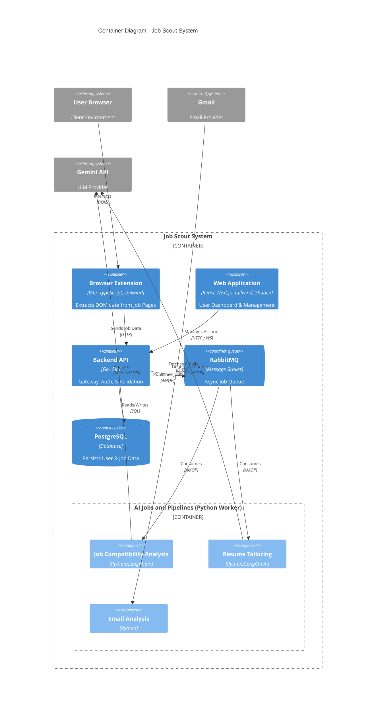

# System Architecture - v0.1

```mermaid
C4Container
    title Container Diagram - Job Scout System

    %% External Actors and Systems
    System_Ext(browser, "User Browser", "Client Environment")
    System_Ext(gmail, "Gmail", "Email Provider")
    System_Ext(gemini, "Gemini API", "LLM Provider")

    %% Main System Boundary
    Container_Boundary(c1, "Job Scout System") {
        
        %% Client Side Containers
        Container(extension, "Browser Extension", "Vite, TypeScript, Tailwind", "Extracts DOM data from Job Pages")
        Container(webapp, "Web Application", "React, Next.js, Tailwind, Shadcn", "User Dashboard & Management")

        %% Backend Core
        Container(api, "Backend API", "Go, Gin", "Gateway, Auth, & Validation")
        
        %% Data & Messaging
        ContainerQueue(rabbitmq, "RabbitMQ", "Message Broker", "Async Job Queue")
        ContainerDb(postgres, "PostgreSQL", "Database", "Persists User & Job Data")

        %% Python Worker Service (Grouped Logic)
        Container_Boundary(worker_boundary, "AI Jobs and Pipelines (Python Worker)") {
            Component(job_logic, "Job Compatibility Analysis", "Python/LangChain")
            Component(resume_logic, "Resume Tailoring", "Python/LangChain")
            Component(email_logic, "Email Analysis", "Python")
        }
    }

    %% Relationships
    %% Flow 1: User/Browser Interaction
    Rel(browser, extension, "Interacts", "DOM")
    Rel(extension, api, "Sends Job Data", "HTTP")

    %% Flow 2: Dashboard Interaction
    Rel(webapp, api, "Manages Account", "HTTP / WS")

    %% Flow 3: Backend Processing
    Rel(api, rabbitmq, "Publishes Jobs", "AMQP")
    Rel(api, postgres, "Reads/Writes", "SQL")

    %% Flow 4: Worker Consumption
    Rel(rabbitmq, job_logic, "Consumes", "AMQP")
    Rel(rabbitmq, resume_logic, "Consumes", "AMQP")
    
    %% Flow 5: External Integrations
    Rel(gmail, email_logic, "Fetches Emails", "HTTP")
    Rel(resume_logic, gemini, "Generates Content", "MCP / HTTPS")
    Rel(job_logic, gemini, "Analyzes", "MCP / HTTPS")

    %% Update Layout (Optional, helps with visualization)
    UpdateRelStyle(browser, extension, $offsetX="-40")
    UpdateRelStyle(extension, api, $offsetX="-40")
    UpdateRelStyle(api, rabbitmq, $offsetX="-40")
```